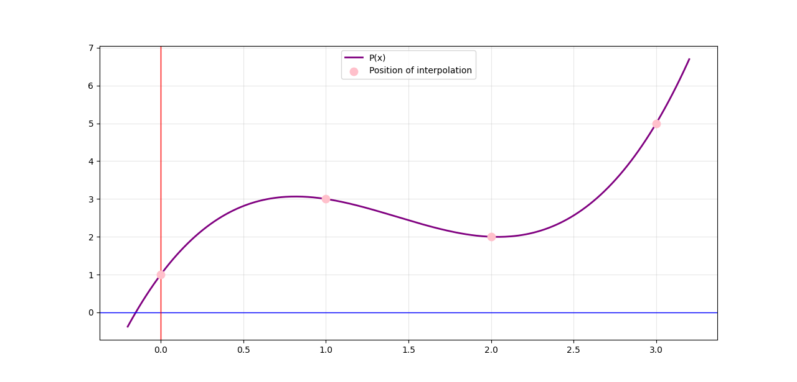
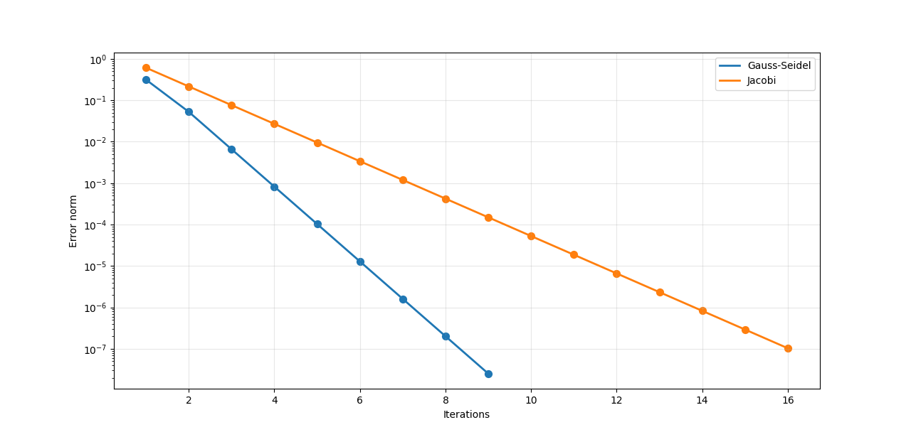

# Numerical Methods: Jacobi and Gauss–Seidel Methods

This project implements and compares two iterative numerical methods for solving systems of linear equations:

* **Jacobi Method**
* **Gauss–Seidel Method**

The implementation is written in **Python** using:

* `NumPy` for matrix computations
* `Matplotlib` for visualization

---

## Problem Definition

The system of equations used in this project is:

Matrix **A**

```text
| 4  1  0 |
| 1  4  1 |
| 0  1  4 |
```

Vector **b**

```text
| 5 |
| 6 |
| 5 |
```

Initial approximation **x₀**

```text
| 0 |
| 0 |
| 0 |
```

---

## Implemented Methods

### Jacobi Method

The Jacobi method updates each variable using values from the previous iteration:

```text
x_i(k+1) = [ b_i - Σ(a_ij * x_j(k)) ] / a_ii
            for j ≠ i
```

where:

* `x_i(k+1)` → new value at iteration `k+1`
* `x_j(k)` → value from previous iteration
* `a_ij` → matrix coefficients

---

### Gauss–Seidel Method

The Gauss–Seidel method improves convergence by immediately reusing newly computed values:

```text
x_i(k+1) = [ b_i
             - Σ(a_ij * x_j(k+1))
             - Σ(a_ij * x_j(k))
           ] / a_ii

for j < i   (new values)
for j > i   (old values)
```

Unlike Jacobi, Gauss–Seidel uses the newest available values during the same iteration, which generally leads to faster convergence.


## Convergence Comparison

The convergence error was computed at each iteration and represented using a logarithmic scale.

### Jacobi Method Convergence



The graph above shows the convergence behavior of the Jacobi method. The error decreases progressively as iterations increase until convergence is achieved.

---

### Gauss–Seidel Method Convergence



The graph above illustrates the convergence behavior of the Gauss–Seidel method. Since updated values are reused immediately, convergence generally occurs faster than with the Jacobi method.

---

## Performance Observation

From the generated results:

* Both methods converge to the same solution.
* Gauss–Seidel typically requires fewer iterations.
* The error decreases more rapidly for Gauss–Seidel.
* The logarithmic scale highlights convergence speed differences clearly.

---

## Project Structure

```text
Analyse_Numerique_TP/
│
├── jacobi.py
├── gauss_seidel.py
├── README.md
│
└── figurs/
    ├── Figure_1.png
    └── Figure_2.png
```

---

## Run the Project

Execute:

```bash
python gauss_seidel.py
```

or:

```bash
python jacobi.py
```

---

## Example Output

```text
Convergence reached after 12 iterations

Solution:
[1. 1. 1.]
```

---

## Requirements

Install dependencies:

```bash
pip install numpy matplotlib
```

---

## Author

MOHAMED EL-BOUANANI.
